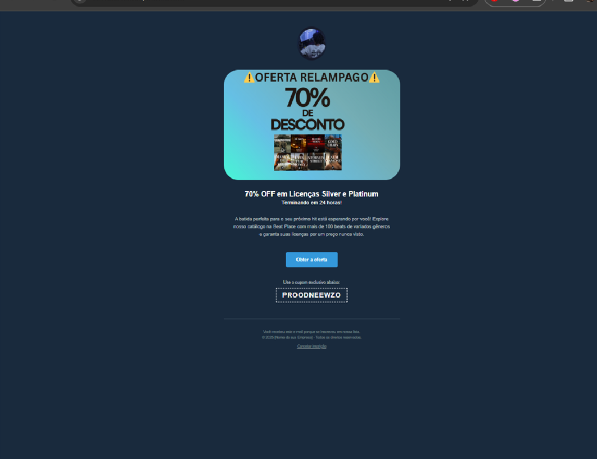

# Template de E-mail Marketing Responsivo - Oferta Relâmpago

[]
## ❯ Sobre o Projeto

Este projeto consiste em um template de e-mail marketing em HTML totalmente responsivo, criado para uma campanha promocional de "Oferta Relâmpago". O design foi desenvolvido com foco em um visual moderno (dark mode), um chamado para ação (CTA) claro e máxima compatibilidade entre os diferentes clientes de e-mail (Gmail, Outlook, Apple Mail, etc.).

Este template foi criado como um item de portfólio para demonstrar habilidades em:
-   Criação de layouts HTML para e-mail, utilizando `<table>` para garantir consistência.
-   Estilização com CSS inline, uma prática essencial para e-mail marketing.
-   Desenvolvimento de um design responsivo que se adapta perfeitamente a desktops e dispositivos móveis.

## ❯ Principais Características

-   **100% Responsivo:** Layout fluido que se ajusta a qualquer tamanho de tela.
-   **Visual Dark Mode:** Design elegante e moderno que reduz o cansaço visual.
-   **Estrutura Robusta:** Construído com tabelas (`<table>`) para garantir a renderização correta em todos os principais clientes de e-mail.
-   **CTA em Destaque:** Um botão de ação claro e visualmente atraente para maximizar as conversões.
-   **Seção de Cupom:** Espaço dedicado para exibir códigos de desconto de forma visível.
-   **HTML e CSS Validados:** Código limpo e semântico.

## ❯ Tecnologias Utilizadas

-   **HTML5**
-   **CSS3 (Inline)**

## ❯ Como Visualizar

1.  Clone este repositório:
    ```sh
    git clone [https://github.com/SEU-USUARIO/SEU-REPOSITORIO.git](https://github.com/SEU-USUARIO/SEU-REPOSITORIO.git)
    ```
2.  Navegue até a pasta do projeto.
3.  Abra o arquivo `index.html` em qualquer navegador de sua preferência (Chrome, Firefox, etc.).

## ❯ Autor

Feito por **Isaac**.

-   **Portfólio:** [Link para seu Portfólio]
-   **LinkedIn:** [Link para seu LinkedIn]
-   **GitHub:** [@SEU-USUARIO]

## ❯ Licença

Este projeto está sob a licença MIT. Veja o arquivo [LICENSE](LICENSE) para mais detalhes.
